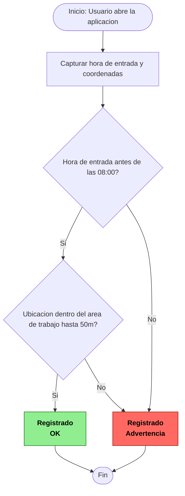

# Diagrama de Flujo - Registro de Hora de Entrada

## Descripción del proceso

Un usuario abre su aplicación para registrar su hora de entrada. El sistema valida que la hora de entrada sea antes de las 8h00, y registra la hora de entrada. También registra las coordenadas de dicha persona para verificar si el usuario se encuentra en el área de trabajo o no, con un margen de 50 metros.

Si entra antes de las 8h00 y se encuentra en la ubicación del área de trabajo, el sistema le dice "Registrado" y OK en color verde. Si una de las opciones anteriores es falsa, el sistema le dice "Registrado" y Advertencia en color rojo.

## Diagrama Mermaid



## ¿Cómo usar este diagrama en GitHub y Obsidian?

**GitHub:** los archivos Markdown (`.md`) renderizan de forma nativa los bloques de código con la etiqueta ` ```mermaid `. Basta con subir este archivo a un repositorio; al visualizarlo en la pestaña principal (no en modo edición), GitHub dibuja el diagrama automáticamente, sin necesidad de instalar ningún plugin.

**Obsidian:** tiene soporte integrado para Mermaid desde hace varias versiones. Al crear o abrir una nota que contenga un bloque ` ```mermaid `, solo hay que cambiar a "Vista previa" (ícono del ojo o `Ctrl+E`) y el diagrama se renderiza automáticamente dentro de la nota, también sin necesidad de plugins adicionales.

En ambos casos el proceso es el mismo: el texto del código Mermaid se interpreta y se convierte en una imagen vectorial del diagrama de flujo cada vez que se visualiza el archivo.
